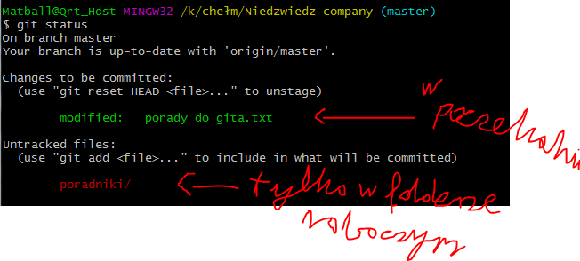
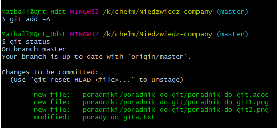
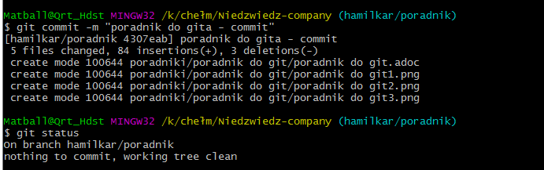

// Jesli to widzisz to zainstaluj rozszerzenie do mozilli
// https://addons.mozilla.org/en-US/firefox/addon/asciidoctorjs-live-preview/

= GIT 

==== 0. Dla pewności ze stworzymy gałąź na podstawie aktualnego masterze

 git checkout master
 git fetch -p
 git rebase origin/master
 

==== 1. Tworzymy gałąź

 git branch mkusy/nazwa-brancha

WARNING: prosiłbym o wpisywanie nazwy użytkownika przy tworzeniu nazwy brancha 
 
w efekcie uzyskujemy nową gałąż która jest oparta na masterze

==== 2. przenosimy się do powstałego brancha

 git checkout mkusy/nazwa-brancha

==== 3. Dzialanie na branchu

https://git-scm.com/book/pl/v1/Pierwsze-kroki-Podstawy-Git
polecam tą stronkę do przejrzenia 

ogólnie są trzy przestrzenie 
- History/Serwer dane - te dane w chmurze

- Index/poczekalnia <---- to stąd do commita trafiają dane 

- Working directory - folder roboczy - to co masz na kompie

====== pokazanie które pliki są w przechowalni( i beda scommitowane przy uzyciu git commit ), a które nie 
 
 git status

//podpierając się  https://kurzyniec.pl/niezbednik-developera/kdiff3-ftw/

 git add -A
 

 
przesuwa wszystkie pliki zmodyfikowane przez cb do indexu

 git commit -m "Nazwa commita"

Pokazuje zrobione przez nas commity na tym branchu
 
 git log

=== 4. Publikujemy branch 

 git push -u origin nasz-branch
 
i mamy już backup na serwerze naszych zmian

=== 5. Merge z masterem lokalnym

 git checkout master

przenosimy się do master, jeśli bedzie robił problemy wpisz git status i zobacz jakie pliki nie zostały zcommitowane i przeszkadzają

 git merge nasz-branch

=== 6. Opublikowanie zmergowania na serwerze

git fetch -p
git rebase origin/master
git push -u origin master
 
 
== Dodanie mergetoola do git-a 

1. Instalka https://sourceforge.net/projects/kdiff3/

2. Kody do zintegrowania z gitem

 git config --global merge.tool kdiff3
 git config --global mergetool.kdiff3.cmd '"C:\\Program Files (x86)\\KDiff3\\kdiff3" $BASE $LOCAL $REMOTE -o $MERGED'

ewentualnie zmodyfikować gitconfig

 [merge]
    tool = kdiff3
[mergetool "kdiff3"]
    cmd = 'C:/Program Files/KDiff3/kdiff3.exe' \"$BASE\" \"$LOCAL\" \"$REMOTE\" -o \"$MERGED\"
    trustExitCode = true

skróty klawiszowe	
	
 [Ctrl] + [1] 	Wrzuć zmiany z A
 [Ctrl] + [2] 	Wrzuć zmiany z B
 [Ctrl] + [3] 	Wrzuć zmiany z C
 [Ctrl] + [Arrow Down] 	Skocz do następnego konfliktu
 [Ctrl] + [Arrow Up] 	Skocz do poprzedniego konfliktu
 [Ctrl] + [Page Down] 	Skocz do następnego nierozwiązanego konfliktu
 [Ctrl] + [Page Up] 	Skocz do poprzedniego nierozwiązanego konfliktu
 [Alt] + [F4] 	Zamknij aktywne okno
 
 
 
 
 
